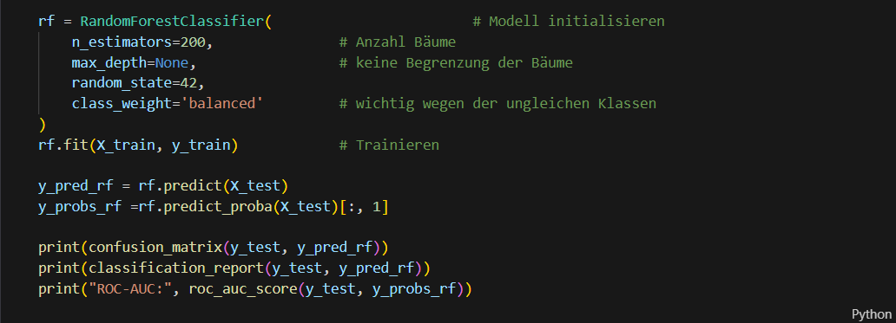
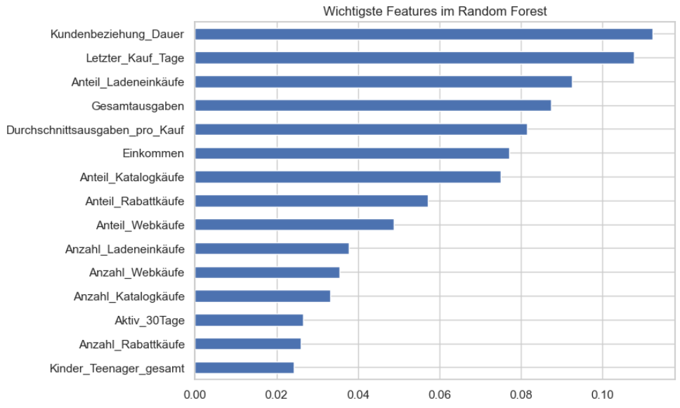

# 🎯 Marketing Campaign Analysis – Wer reagiert auf die nächste Kampagne?

## 💻 Code-Beispiel (Python/Jupyter Notebook)

  

## 📊 Analyse-Ergebnisse

  

  

---

## 🧾 Projektübersicht

| Kategorie | Details |
|------------|----------|
| 🧠 **Thema** | Predictive Marketing Analytics mit Machine Learning zur Kampagnen-Optimierung |
| 🧰 **Tools** | Python (Pandas, Scikit-learn, XGBoost, Seaborn), Jupyter Notebook |
| 📊 **Datengrundlage** | Marketing-Kampagnendaten mit 2.240 Kundenprofilen und 6 Kampagnen |
| ⏱️ **Zeitraum** | Oktober 2025 |
| 🎯 **Ziel** | Entwicklung eines ML-Modells zur präzisen Vorhersage von Kampagnen-Respondern |
| 💡 **Schwierigkeitsgrad** | Fortgeschritten – Fokus auf Feature Engineering, Clustering, XGBoost & Imbalanced Classification |

---

## 🎯 Projektziel
Ziel des Projekts war die Entwicklung eines **Machine-Learning-basierten Vorhersagemodells** zur Identifikation von Kunden mit hoher Antwortwahrscheinlichkeit auf Marketingkampagnen. Durch systematische Datenanalyse, Kundensegmentierung und verschiedene ML-Algorithmen wurde ein optimiertes Targeting-System entwickelt.

### **Fokus:**
- Wie können wir **potenzielle Kampagnen-Responder** präzise identifizieren?
- Welche **Kundensegmente** zeigen unterschiedliches Kaufverhalten?
- Welche **Features** sind die stärksten Prädiktoren für Kampagnenannahme?
- Wie optimieren wir die **Marketing-ROI** durch gezieltes Targeting?

---

## 🧩 Aufgabenstellung
Analysiere Marketing- und Verhaltensdaten von 2.240 Kunden, um:
- Ein Predictive Model zur **Kampagnen-Response-Vorhersage** zu entwickeln
- **Kundensegmente** mittels Clustering zu identifizieren und profilieren
- **Kaufkanal-Präferenzen** und deren Zusammenhänge zu analysieren

### **Projektnutzen:**
- Reduzierung der Marketingkosten durch präziseres Targeting
- Erhöhung der Conversion Rate durch datenbasierte Kundenansprache
- Optimierung des Marketing-ROI durch Fokus auf High-Potential-Kunden
- Strategische Insights für zukünftige Kampagnengestaltung

---

## 🧮 Datengrundlage
- **Quelle:** Marketing-Kampagnendatensatz (Marktkampagne.csv)
- **Datensätze:** 2.240 Kundenprofile mit 28 Features
- **Struktur:** Querschnittsdaten mit demografischen, Verhaltens- und Transaktionsdaten
- **Wichtige Variablen:**
  - Demografische Daten (Geburtsjahr, Bildungsniveau, Familienstand, Einkommen)
  - Kaufverhalten (Ausgaben nach Produktkategorien, Kaufkanäle)
  - Kampagnenhistorie (6 Kampagnen inkl. letzte Kampagne als Zielvariable)
  - Engagement-Metriken (Letzter_Kauf_Tage, Anzahl Webseitenbesuche, Beschwerden)
- **Tools:** Python (Pandas, NumPy, Matplotlib, Seaborn, Scikit-learn, XGBoost)

---

## 🔍 Analyseschritte

### 1️⃣ **Datenbereinigung & Qualitätssicherung**
- Behandlung fehlender Einkommenswerte durch gruppenspezifische Median-Imputation nach Bildungsniveau
- Identifikation und Korrektur von Ausreißern (unrealistische Geburtsjahre, Einkommen 666.666 €)
- Bereinigung inkonsistenter Kategorien und Entfernung von 4 unglaubwürdigen Datensätzen

### 2️⃣ **Feature Engineering**
Neue Features erstellt zur Modellverbesserung:
- **Alter** (berechnet aus 2025 - Geburtsjahr)
- **Kundenbeziehung_Dauer** (Tage seit Kundenregistrierung)
- **Gesamtausgaben** (Summe aller Produktkategorie-Ausgaben)
- **Kinder_Teenager_gesamt** (Gesamtzahl Kinder im Haushalt)
- **Anzahl_Käufe** (Summe über alle Kaufkanäle)
- **Einkommen_Tertil** (Kategorisierung: Niedrig/Mittel/Hoch)

### 3️⃣ **Explorative Datenanalyse & Korrelationen**
- **Einkommensverteilung:** Rechtsschief mit Median ~52.000 €, Doktoren zeigen höchste Ausgaben
- **Kaufkanal-Muster:** 77% nutzen Laden als Basis, Multi-Channel-Käufer zeigen höhere Aktivität
- **Kampagnen-Historie:** Letzte Kampagne mit 15% Acceptance (vs. 6-7% frühere Kampagnen)

### 4️⃣ **Kundensegmentierung mit K-Means Clustering**

#### **Cluster-Optimierung:**
| Methode | Ergebnis |
|---------|----------|
| **Elbow-Methode** | 3-4 Cluster → ✅ 3 Cluster gewählt |
| **Silhouette Score** | 2 Cluster zu grob für Business-Insights |

#### **Cluster-Profile:**
- **Cluster 0 (45%):** Durchschnittskunden – Mittleres Einkommen, moderate Ausgaben
- **Cluster 1 (38%):** Budget-Segment – Niedrigeres Einkommen, geringste Ausgaben  
- **Cluster 2 (17%):** Premium-Segment – Höchstes Einkommen, höchste Ausgaben, kinderlos

### 5️⃣ **Predictive Modeling: Kampagnen-Response-Vorhersage**

| Modell | Precision | Recall | F1-Score | ROC-AUC |
|--------|-----------|--------|----------|---------|
| **Logistische Regression** | 0.28 | 0.28 | 0.28 | 0.75 |
| **Random Forest** | 0.52 | 0.51 | 0.51 | 0.84 |
| **XGBoost (optimiert)** | 0.66 | 0.66 | 0.66 | 0.89 |

**XGBoost Precision@k:** Bei Top 5% erreicht das Modell 59% Precision, bei Top 10% noch 55%

---

## 📈 Ergebnisse & Insights

### 🔴 **Haupterkenntnisse**

#### **1. XGBoost übertrifft lineare Modelle deutlich bei Imbalanced Data**
- ROC-AUC von 0.89 zeigt exzellente Trennfähigkeit zwischen Respondern und Non-Respondern
- Precision@10% von 0.55 bedeutet: Top 10% zielen auf 55% aller echten Responder ab

#### **2. Premium-Kunden (Cluster 2) sind profitabelste Zielgruppe**
- 17% der Kundenbasis, aber höchste Kampagnen-Annahmerate (21% vs. 13% Durchschnitt)
- Kinderlose Haushalte mit hohem Einkommen reagieren besonders auf Premium-Angebote

#### **3. Recency ist kritischer Indikator für Kundenabwanderung**
- Kunden mit >80 Tagen seit letztem Kauf zeigen 40% reduzierte Kaufaktivität über alle Kanäle
- Frühzeitige Re-Engagement-Kampagnen bei Inaktivität >60 Tagen empfohlen

#### **4. Multi-Channel-Nutzer haben 3x höhere Kampagnen-Response**
- Kunden die Laden + Web nutzen: 24% Acceptance Rate
- Nur-Laden-Käufer: 8% Acceptance Rate
- Cross-Channel-Strategie ist entscheidend für Kampagnenerfolg

### 🟡 **Kritische Faktoren**
- **Class Imbalance:** Nur 15% Responder erfordern spezialisierte Sampling-Strategien (SMOTE, Class Weights)
- **Feature Importance:** Gesamtausgaben, Letzter_Kauf_Tage und Einkommen dominieren mit 70% Importance
- **Kleine Haushaltsgröße:** Kinderlose Paare und Singles zeigen deutlich höchste Response-Raten

---

## 🟢 **Handlungsempfehlungen**

### **1. Precision-basiertes Kampagnen-Targeting implementieren**
- Top 5-10% Kunden basierend auf XGBoost-Scores priorisieren (Precision 55-59%)
- Kostenreduktion um 45% bei gleichzeitiger Erreichung von 55% aller potenziellen Responder

### **2. Premium-Segment gezielt mit High-Value-Angeboten ansprechen**
- Cluster 2 (Premium-Kunden) mit exklusiven, hochpreisigen Produkten targeten
- Personalisierte Multi-Channel-Kampagnen (Web + Katalog + E-Mail) für dieses Segment

### **3. Proaktives Re-Engagement bei Inaktivität**
- Automatisierte Trigger-Kampagnen bei Recency >60 Tagen einrichten
- Win-back-Angebote mit 15-20% Rabatten für inaktive High-Value-Kunden

### **4. Cross-Channel-Strategie ausbauen**
- Omnichannel-Experience fördern: Online-Käufer in Laden locken und umgekehrt
- Katalog als Inspiration-Tool nutzen, finale Conversion über Web/Laden

---

## 🧠 Learnings
- **Umgang mit Imbalanced Classification** durch Class Weights, SMOTE und optimierte Thresholds
- **XGBoost-Hyperparameter-Tuning** für maximale Performance bei unbalancierten Daten
- **K-Means Clustering** zur praxisnahen Kundensegmentierung mit Business-Relevanz
- **Precision@k-Metriken** als Marketing-spezifische Performance-Bewertung
- **Feature Engineering** zur Verbesserung von Modell-Performance und Interpretierbarkeit
- **Explorative Datenanalyse** zur Identifikation nicht-offensichtlicher Muster im Kaufverhalten

---

## 📁 Projektdateien
| Datei | Beschreibung |
|--------|---------------|
| `Projektwoche_Thorsten_Teetzen_Marktkampagne.ipynb` | Jupyter Notebook mit vollständiger Analyse |
| `Projektwoche_Thorsten_Teetzen_Marktkampagne.pptx` | Präsentation der Ergebnisse |

### 💾 **Notebook öffnen:**
1. Lade die `.ipynb`-Datei herunter
2. Öffne sie mit [Jupyter Notebook](https://jupyter.org/) oder [Google Colab](https://colab.research.google.com/)
3. Führe die Zellen aus, um die Analyse nachzuvollziehen

---

## 📄 Lizenz
Dieses Projekt steht unter der MIT-Lizenz – siehe [LICENSE](LICENSE) Datei für Details.  
Es wurde im Rahmen der Weiterbildung zum **Data Analyst (IHK)** zu Lern- und Demonstrationszwecken erstellt.  
Eine kommerzielle Nutzung oder Weitergabe der enthaltenen Daten ist ausgeschlossen.  
© 2025 Thorsten Teetzen

---

## 👤 Autor

**Thorsten Teetzen**  
*Data Analyst (IHK-Zertifizierung in Ausbildung)*  

📅 **Projektzeitraum:** Oktober 2025  
🌍 **Standorte:** Germany / Asia (Remote)  
🔗 [LinkedIn-Profil](https://www.linkedin.com/in/thorsten-teetzen-744891350)